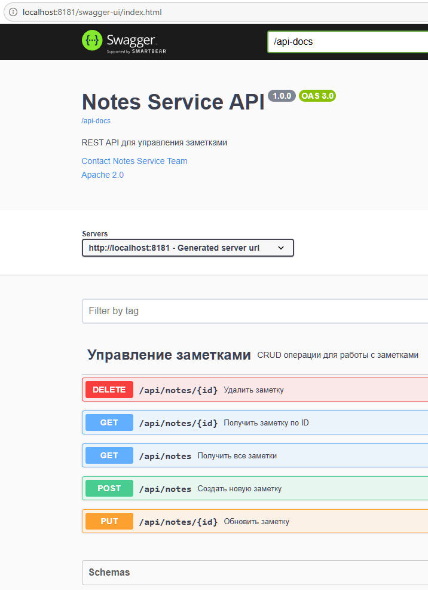

# 📝 Notes Service

> **REST API сервис для управления заметками на Spring Boot**

[](https://adoptium.net/)
[](https://spring.io/projects/spring-boot)
[](https://maven.apache.org/)
[](https://www.docker.com/)
[](https://swagger.io/)
[](https://opensource.org/licenses/Apache-2.0)
---

## 📋 Оглавление

- [🚀 Быстрый старт](#-быстрый-старт)
- [📚 API Документация](#-api-документация)
- [🔧 API Эндпоинты](#-api-эндпоинты)
- [📦 Примеры запросов](#-примеры-запросов)
- [📊 Мониторинг](#-мониторинг)
- [🏗️ Архитектура](#-архитектура)
- [🛠️ Технологии](#-технологии)
- [📁 Структура проекта](#-структура-проекта)
- [🧪 Тестирование](#-тестирование)
- [🐳 Docker](#-docker)
- [📝 Лицензия](#-лицензия)

---

## 🚀 Быстрый старт

### Требования

| Инструмент     | Версия               |
|----------------|----------------------|
| Java           | 17+                  |
| Maven          | 3.8+                 |
| Docker         | 20.10+ (опционально) |
| Docker Compose | 2.0+ (опционально)   |

### Запуск через Maven

```bash
# Клонирование репозитория
git clone https://github.com/your-repo/notes-service.git
cd notes-service

# Сборка и запуск
mvn clean install
mvn spring-boot:run
```

### Запуск через Docker

```bash
# Сборка образа
docker build -t notes-service .

# Запуск контейнера
docker run -d -p 8181:8181 --name notes-app notes-service

# Проверка работы
curl http://localhost:8181/api/notes
```

### Запуск через Docker Compose

```bash
# Запуск всех сервисов
docker-compose up -d

# Просмотр логов
docker-compose logs -f

# Остановка
docker-compose down
```

---

## 📚 API Документация

После запуска приложения документация доступна по следующим адресам:

| Ресурс           | URL                                     | Описание                       |
|------------------|-----------------------------------------|--------------------------------|
| **Swagger UI**   | `http://localhost:8181/swagger-ui.html` | Интерактивная документация API |
| **OpenAPI JSON** | `http://localhost:8181/api-docs`        | JSON спецификация OpenAPI      |
| **OpenAPI YAML** | `http://localhost:8181/api-docs.yaml`   | YAML спецификация OpenAPI      |

### Скриншот Swagger UI



*Интерактивная документация API с возможностью тестирования эндпоинтов*

---

## 🔧 API Эндпоинты

| Метод    | URL                    | Описание               | Коды ответа   |
|----------|------------------------|------------------------|---------------|
| `GET`    | `/api/notes`           | Получить все заметки   | 200, 500      |
| `GET`    | `/api/notes?tag={tag}` | Фильтрация по тегу     | 200, 500      |
| `GET`    | `/api/notes/{id}`      | Получить заметку по ID | 200, 404      |
| `POST`   | `/api/notes`           | Создать новую заметку  | 201, 400      |
| `PUT`    | `/api/notes/{id}`      | Обновить заметку       | 200, 400, 404 |
| `DELETE` | `/api/notes/{id}`      | Удалить заметку        | 204, 404      |

Вот правильно оформленный раздел с моделью данных:

### Модель данных

#### Запрос (NoteRequest)

| Поле      | Тип             | Ограничения       | Описание                   |
|-----------|-----------------|-------------------|----------------------------|
| `title`   | `string`        | 1-100 символов    | Заголовок заметки          |
| `content` | `string`        | 1-1000 символов   | Содержимое заметки         |
| `tags`    | `array[string]` | максимум 10 тегов | Список тегов (опционально) |

**Пример:**

```json
{
  "title": "Рабочая встреча",
  "content": "Обсуждение проекта в 15:00",
  "tags": [
    "work",
    "meeting"
  ]
}
```

#### Ответ (NoteResponse)

| Поле        | Тип             | Описание                                 |
|-------------|-----------------|------------------------------------------|
| `id`        | `integer`       | Уникальный идентификатор заметки         |
| `title`     | `string`        | Заголовок заметки                        |
| `content`   | `string`        | Содержимое заметки                       |
| `createdAt` | `string`        | Дата и время создания в формате ISO 8601 |
| `tags`      | `array[string]` | Список тегов                             |

**Пример:**

```json
{
  "id": 1,
  "title": "Рабочая встреча",
  "content": "Обсуждение проекта в 15:00",
  "createdAt": "2026-07-08T10:00:00",
  "tags": [
    "work",
    "meeting"
  ]
}
```

#### Коды ответов

| Код                         | Описание                  |
|-----------------------------|---------------------------|
| `200 OK`                    | Успешный запрос           |
| `201 Created`               | Заметка успешно создана   |
| `204 No Content`            | Заметка успешно удалена   |
| `400 Bad Request`           | Ошибка валидации данных   |
| `404 Not Found`             | Заметка не найдена        |
| `500 Internal Server Error` | Внутренняя ошибка сервера |

---

## 📦 Примеры запросов

### 1. Создание заметки

```bash
curl -X POST http://localhost:8181/api/notes \
  -H "Content-Type: application/json" \
  -d '{
    "title": "Рабочая встреча",
    "content": "Обсуждение проекта в 15:00",
    "tags": ["work", "meeting"]
  }'
```

**Ответ:**

```json
{
  "id": 1,
  "title": "Рабочая встреча",
  "content": "Обсуждение проекта в 15:00",
  "createdAt": "2026-07-08T10:00:00",
  "tags": [
    "work",
    "meeting"
  ]
}
```

### 2. Получение всех заметок

```bash
curl http://localhost:8181/api/notes
```

**Ответ:**

```json
[
  {
    "id": 1,
    "title": "Рабочая встреча",
    "content": "Обсуждение проекта в 15:00",
    "createdAt": "2026-07-08T10:00:00",
    "tags": [
      "work",
      "meeting"
    ]
  },
  {
    "id": 2,
    "title": "Личная заметка",
    "content": "Купить продукты",
    "createdAt": "2026-07-08T11:30:00",
    "tags": [
      "personal"
    ]
  }
]
```

### 3. Фильтрация по тегу

```bash
curl "http://localhost:8181/api/notes?tag=work"
```

### 4. Получение заметки по ID

```bash
curl http://localhost:8181/api/notes/1
```

### 5. Обновление заметки

```bash
curl -X PUT http://localhost:8181/api/notes/1 \
  -H "Content-Type: application/json" \
  -d '{
    "title": "Обновленная встреча",
    "content": "Новое время 16:00",
    "tags": ["work", "updated"]
  }'
```

### 6. Удаление заметки

```bash
curl -X DELETE http://localhost:8181/api/notes/1
```

---

## 📊 Мониторинг

Приложение предоставляет эндпоинты для мониторинга состояния через Spring Boot Actuator.

### Доступные эндпоинты

| Сервис         | URL                                         | Описание                                 |
|----------------|---------------------------------------------|------------------------------------------|
| **API**        | `http://localhost:8181/api/notes`           | Основной эндпоинт для работы с заметками |
| **Swagger UI** | `http://localhost:8181/swagger-ui.html`     | Интерактивная документация API           |
| **Health**     | `http://localhost:8181/actuator/health`     | Проверка здоровья приложения             |
| **Info**       | `http://localhost:8181/actuator/info`       | Информация о приложении                  |
| **Metrics**    | `http://localhost:8181/actuator/metrics`    | Метрики приложения                       |
| **Prometheus** | `http://localhost:8181/actuator/prometheus` | Метрики для Prometheus                   |

### Примеры запросов

```bash
# Проверка здоровья
curl http://localhost:8181/actuator/health

# Получение всех метрик
curl http://localhost:8181/actuator/metrics

# Конкретная метрика (например, количество запросов)
curl http://localhost:8181/actuator/metrics/http.server.requests

# Информация о приложении
curl http://localhost:8181/actuator/info

# Метрики для Prometheus
curl http://localhost:8181/actuator/prometheus
```

**Пример ответа Health:**

```json
{
  "status": "UP",
  "components": {
    "diskSpace": {
      "status": "UP"
    },
    "ping": {
      "status": "UP"
    }
  }
}
```

Пример ответа Info:

```json
{
  "app": {
    "name": "Notes Service",
    "version": "1.0.0",
    "description": "REST API для управления заметками",
    "java-version": "17",
    "spring-boot-version": "3.1.5"
  }
}
```

---

## 🏗️ Архитектура

Проект построен на принципах **Clean Architecture** и **SOLID**:

```text
┌─────────────────────────────────────────────────────────┐
│                     Presentation Layer                   │
│          (Controller, DTO, Validation, Swagger)         │
├─────────────────────────────────────────────────────────┤
│                    Application Layer                     │
│              (Service, Business Logic)                  │
├─────────────────────────────────────────────────────────┤
│                     Domain Layer                         │
│                (Model, Domain Entities)                 │
├─────────────────────────────────────────────────────────┤
│                  Infrastructure Layer                    │
│           (Repository, In-Memory Storage)               │
└─────────────────────────────────────────────────────────┘
```

### Слои приложения

| Слой               | Компоненты                  | Ответственность                    |
|--------------------|-----------------------------|------------------------------------|
| **Presentation**   | Controller, DTO, Validation | Обработка HTTP запросов, валидация |
| **Application**    | Service, Business Logic     | Бизнес-логика, транзакции          |
| **Domain**         | Model, Entities             | Доменная модель, правила           |
| **Infrastructure** | Repository, Storage         | Хранение данных, доступ к БД       |

---

## 🛠️ Технологии

| Технология            | Версия  | Назначение               |
|-----------------------|---------|--------------------------|
| **Java**              | 17      | Язык программирования    |
| **Spring Boot**       | 3.1.5   | Фреймворк для разработки |
| **Spring Web**        | 3.1.5   | REST API                 |
| **Spring Actuator**   | 3.1.5   | Мониторинг               |
| **Spring Validation** | 3.1.5   | Валидация данных         |
| **Maven**             | 3.8+    | Сборка проекта           |
| **Lombok**            | 1.18.30 | Сокращение кода          |
| **Swagger/OpenAPI**   | 2.5.0   | Документация API         |
| **Docker**            | -       | Контейнеризация          |
| **JUnit 5**           | -       | Тестирование             |
| **Mockito**           | -       | Мокирование              |

---

## 📁 Структура проекта

```text
notes-service/
├── src/
│   ├── main/
│   │   ├── java/
│   │   │   └── com/example/notes/
│   │   │       ├── NotesApplication.java          # Главный класс приложения
│   │   │       ├── config/
│   │   │       │   └── SwaggerConfig.java        # Конфигурация Swagger
│   │   │       ├── controller/
│   │   │       │   └── NoteController.java       # REST контроллер
│   │   │       ├── dto/
│   │   │       │   ├── NoteRequest.java          # DTO для запросов
│   │   │       │   └── NoteResponse.java         # DTO для ответов
│   │   │       ├── service/
│   │   │       │   ├── NoteService.java          # Интерфейс сервиса
│   │   │       │   └── NoteServiceImpl.java      # Реализация сервиса
│   │   │       ├── repository/
│   │   │       │   ├── NoteRepository.java       # Интерфейс репозитория
│   │   │       │   └── InMemoryNoteRepository.java # In-memory реализация
│   │   │       └── model/
│   │   │           └── Note.java                 # Модель заметки
│   │   └── resources/
│   │       └── application.yml                    # Конфигурация приложения
│   └── test/
│       └── java/
│           └── com/example/notes/service/
│               └── NoteServiceImplTest.java       # Unit-тесты
├── pom.xml                                       # Maven конфигурация
├── Dockerfile                                    # Docker конфигурация
├── docker-compose.yml                            # Docker Compose конфигурация
└── README.md                                     # Документация
```

---

## 🧪 Тестирование

### Запуск тестов

```bash
# Запуск всех тестов
mvn test

# Запуск конкретного теста
mvn test -Dtest=NoteServiceImplTest

# Запуск с отчетом о покрытии
mvn clean test jacoco:report

# Запуск интеграционных тестов
mvn verify
```

### Покрытие тестами

```bash
# Отчет о покрытии доступен по адресу:
open target/site/jacoco/index.html
```

### Пример Unit-теста

```java

@Test
void createNote_ShouldReturnCreatedNote_WhenValid() {
    // Arrange
    when(noteRepository.save(any(Note.class))).thenReturn(testNote);

    // Act
    Note created = noteService.createNote(testNote);

    // Assert
    assertNotNull(created);
    assertEquals("Test Note", created.getTitle());
    verify(noteRepository, times(1)).save(any(Note.class));
}
```

---

## 🐳 Docker

### Команды Docker

```bash
# Сборка образа
docker build -t notes-service .

# Запуск контейнера
docker run -d -p 8181:8181 --name notes-app notes-service

# Просмотр логов
docker logs -f notes-app

# Просмотр статуса
docker ps | grep notes-app

# Остановка контейнера
docker stop notes-app

# Запуск остановленного контейнера
docker start notes-app

# Удаление контейнера
docker rm notes-app

# Удаление образа
docker rmi notes-service
```

### Docker Compose

```bash
# Запуск всех сервисов
docker-compose up -d

# Просмотр логов
docker-compose logs -f

# Перезапуск сервиса
docker-compose restart

# Остановка всех сервисов
docker-compose down

# Остановка с удалением томов
docker-compose down -v
```

---

## 📝 Лицензия

Этот проект распространяется под лицензией **Apache 2.0**.

```text
Copyright 2026 Notes Service Team

Licensed under the Apache License, Version 2.0 (the "License");
you may not use this file except in compliance with the License.
You may obtain a copy of the License at

    https://www.apache.org/licenses/LICENSE-2.0

Unless required by applicable law or agreed to in writing, software
distributed under the License is distributed on an "AS IS" BASIS,
WITHOUT WARRANTIES OR CONDITIONS OF ANY KIND, either express or implied.
See the License for the specific language governing permissions and
limitations under the License.
```

---

## 👨‍💻 Контакты

| Роль         | Контакт                                             |
|--------------|-----------------------------------------------------|
| Разработчик  | [GitHub](https://github.com/your-repo)              |
| Email        | support@notes-service.com                           |
| Документация | [Swagger UI](http://localhost:8181/swagger-ui.html) |

---

## ⭐ Поддержка

Если вам понравился проект, поставьте ⭐ на GitHub!

---

**Сделано с ❤️ командой Notes Service Team**

```